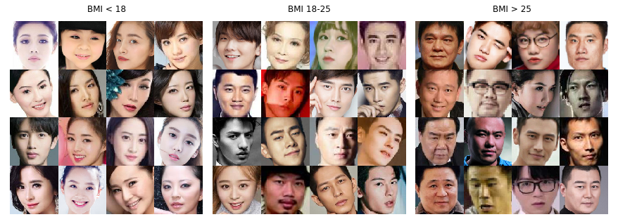
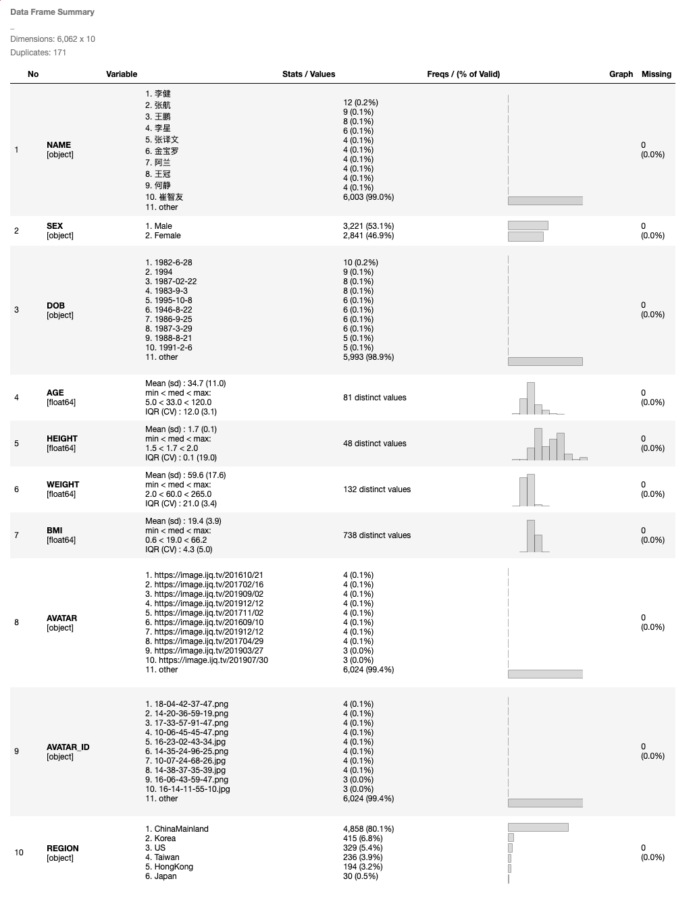

# Chinese Celebrity Faces



* `chinese-celebrity-faces.csv`: meta data
* `data.csv`: chinese version meta data, which contain more information (e.g. Weibo, Bio)
* images: original images collected
* faces: aligned images (using MTCNN)

_the majority of the data is from China Mainland celebrities. However it do contains celebrities from other countries/regions_

_Caveats:_

* [Age] is derived from `DOB`, which may be inconsistent with the time the photo was taken.
* [Sex] is derived from `bio` field in `data.csv`, by matching any `男女他她` to guess the gender.

## Data Summary



## Download from Google Drive

* [Google Drive Download Page](https://drive.google.com/drive/folders/1h-nkF4MaeNYlM1zPGJ_dBDv6ObmDdX51?usp=sharing)
* or using `gdown`
```
pip install gdown
# faces.zip
gdown https://drive.google.com/uc?id=1KekADu8uirNsJ3VxgcE2SovVddj-k794
# images.zip
gdown https://drive.google.com/uc?id=14iO6Xu1gFmMUjrr1IggSE1WxonyjyJCb
```
* use `AVATAR_ID` to link the `meta` data and `faces` or `images`